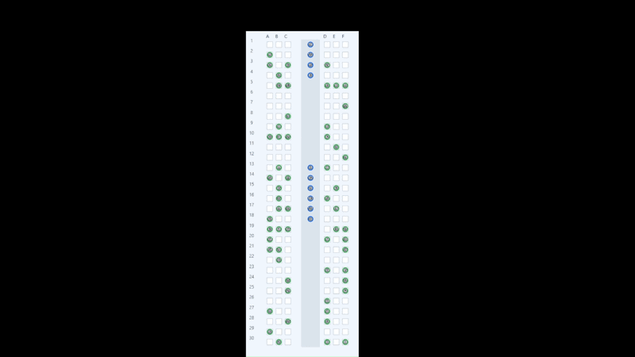

# AeroBoard

AeroBoard ist eine GitHub-Pages-kompatible Websimulation fuer Flugzeug-Boarding (Top-Down-Ansicht, 30 Reihen).  
Das Projekt ist modular aufgebaut, damit spaeter Python-Optimierung, Familienlogik, Seat-Interference und echte Cluster-Verfahren ergaenzt werden koennen.

## Live-Demo

Im Browser ohne Installation: **[AeroBoard auf GitHub Pages](https://makemepaul.github.io/PlaneSeatOptimisation/)**

### Simulation (GIF)

[](https://makemepaul.github.io/PlaneSeatOptimisation/)

Die Animation liegt als `docs/simulation-demo.gif` im Repository (Klick auf das Bild oeffnet die Live-Demo).

## Projektstruktur

- `docs/` Medien (z. B. Demo-Animation `simulation-demo.gif`)
- `index.html` UI-Struktur und Controls
- `style.css` Layout und Darstellung
- `app.js` Kernlogik (Passenger, Plane, Simulation, Rendering, UI-Events)
- `algorithms.js` Boarding-Strategien
- `backend/main.py` Platzhalter fuer spaeteres FastAPI-Backend

## Lokaler Start

Da keine Libraries und kein Build-System verwendet werden, reicht ein statischer Webserver:

```powershell
python -m http.server 8000
```

Danach im Browser oeffnen:

`http://localhost:8000`

Alternativ kann `index.html` direkt geoeffnet werden; empfohlen ist trotzdem ein lokaler Server.

## GitHub Pages Deployment

1. Repository nach GitHub pushen.
2. In GitHub unter `Settings -> Pages` als Source den Branch (z. B. `main`) und das Root-Verzeichnis (`/`) auswaehlen.
3. Speichern und auf die veroeffentlichte URL warten.

Da das Frontend nur aus statischen Dateien besteht, ist es ohne weitere Anpassungen GitHub-Pages-faehig.

## Enthaltene Boarding-Algorithmen

- `random`
- `backToFront`
- `windowMiddleAisle`
- `steffenDeterministic` (deterministische Steffen-Naeherung: Fenster vor Mitte vor Gang, ungerade/gerade Reihenabstand, rueckwaerts pro Phase; **ohne Zufall**, reproduzierbar)
- `prototypeCluster`
- `heuristicCluster`
- `tickSearch` (vorgelagerte Stichprobe: simuliert mehrere zufaellige Reihenfolgen plus Ausgangspunkt `boundedAStar` und waehlt die niedrigste Tick-Zahl; rechenintensiv)
- `exactAStar` (vollstaendiges A* fuer kleine Passagiermengen)
- `boundedAStar` (approximiertes, budgetiertes A* fuer groessere Passagiermengen)

Die Implementierungen liegen in `algorithms.js` und koennen unabhaengig von Rendering/UI erweitert oder ersetzt werden.  
Die Algorithmen sind gruppenbewusst vorbereitet: Passagiere werden zuerst nach `groupId` gebuendelt und nur als Gruppe sortiert, sodass Gruppen nicht getrennt werden.  
Passagiere ohne `groupId` werden als Einzelgruppen behandelt (`groupId` standardmaessig `null`).

`windowMiddleAisle` ist als zonenweises Verfahren umgesetzt: zuerst rear (`21-30`), dann middle (`11-20`), dann front (`1-10`), jeweils mit `window -> middle -> aisle` und back-to-front innerhalb gleicher Prioritaet. `steffenDeterministic` folgt einer festen Steffen-artigen Phasenfolge (Fenster/Mitte/Gang, ungerade/gerade Reihen, hinten nach vorne innerhalb jeder Phase) und ist vollstaendig deterministisch. `prototypeCluster` sortiert Zonen **rueckwaerts** (Reihen 25-30 zuerst, dann Richtung Vorderteil), damit der Einstieg am Bug nicht die hintere Kabine blockiert.

## Passenger Profiles

- Profile: `business`, `standard`, `elderly`, `child`, `heavy_luggage`
- Option in der UI: `Passagierprofile aktivieren` (standardmaessig aktiv)
- Option in der UI: `Benchmark-Modus: fixe Standardzeiten` (setzt fuer Benchmark-Zwecke `standard`, `stowTime=10`, `moveCooldown=0`)
- Profile beeinflussen nur Verhalten (z. B. `stowTime`, `moveCooldown`) und Tooltip-Informationen
- Farben werden deterministisch aus `clusterId` abgeleitet (algorithmusabhaengig)
- `groupId` bleibt pro Passenger erhalten und ist fuer spaetere Familienlogik vorbereitet

## Seat Occupancy Modell

- `Plane` verwaltet jetzt sowohl `aisle` als auch echte Sitzbelegung (`seats[row][seatLetter]`).
- Wenn ein Passenger mit Stowing fertig ist, wird er in seinen Ziel-Sitz ueberfuehrt und der Gang-Slot wird frei.
- Die Statistik `Sitzend` basiert auf der aktuell belegten Sitzanzahl (`getOccupiedSeatsCount()`).
- Seat-Interference/Blockaden sind implementiert: nach `stowing` folgt bei Bedarf `seating`, bevor `seated` gesetzt wird.

## Feature-Status

- Zustandskette: `waiting -> walking -> stowing -> seating -> seated` (implementiert)
- Seat Occupancy (`seats[row][seatLetter]`) (implementiert)
- Seat Interference (Fenster/Mitte/Gang-Regeln) (implementiert)
- Profile (`stowTime`, `moveCooldown`) (implementiert)
- Familien-/Gruppenlogik (vorbereitet, noch kein eigener Generator)
- Vergleichsmodus mit parallelen Simulationen und Ergebnis-Tabelle (implementiert)
- Python/FastAPI-Backend-Anbindung (geplant)

## Vergleichsmodus und Fairness

- Die UI unterscheidet zwischen `Normale Verfahren` und `Optimierte Verfahren`.
- Einzelsimulation und Vergleichsmodus sind getrennt:
  - Einzelsimulation: genau ein Algorithmus, mit `Start`, `Pause`, `Ein Tick`, `Reset`.
  - Vergleichsmodus: mehrere Algorithmen per Checkbox und gemeinsamer Start.
- Fuer faire Vergleiche wird einmal ein `basePassengerSet` erzeugt und pro Algorithmus geklont.
- Jede Vergleichs-Simulation hat eigene Objekte (`Plane`, Queue, Tick-Zaehler, finished-Status), aber identische Basisdaten (`id`, `targetSeat`, `profile`, `stowTime`, `moveCooldown`, `groupId`).
- In der **Vergleichstabelle** und in der **Einzelsimulation** steht der Anzeigename `Exact A* fallback -> Bounded A*`, sobald `exactAStar` wegen der Passagiergrenze (9) intern auf `boundedAStar` wechselt.
- `heuristicCluster` und beide A*-Varianten optimieren ein **heuristisches Kostenmodell** (kein direkter Vorab-Bezug zu finalen Simulations-Ticks). `tickSearch` waehlt dagegen anhand **vollstaendig durchlaufener Mini-Simulationen** (Stichprobe) die Reihenfolge mit der niedrigsten Tick-Zahl; das ist teuer, aber an die UI-Metrik angekoppelt.
- `exactAStar` berechnet fuer kleine N den vollstaendigen Suchraum vor dem Tick-Loop.
- `boundedAStar` verwendet eine budgetierte Suche vor dem Tick-Loop (nicht optimalitaetsgarantiert).

## Batch-Vergleich (Statistik)

- Nutzt dieselben Algorithmus-Checkboxen wie der einfache Vergleich; die Simulation laeuft **ohne** Canvas-Rendering, mit Zeitscheiben (`setTimeout`), damit die Seite nicht einfriert.
- Pro **Lauf** `i`: ein gemeinsamer Passagier-Datensatz mit Seed `AEROBOARD_BATCH_BASE_SEED + i` (Konstante in `app.js`), fuer jeden Algorithmus eine vollstaendige Tick-Simulation mit eigenem deterministischem `simSeed` (Mix aus Blueprint-Seed und Algorithmus-Schluessel).
- Gewinner pro Lauf: minimalste Tick-Zahl; bei Gleichstand erhalten **alle** Beteiligten einen Sieg.
- **Siegrate** = Siege geteilt durch die **abgeschlossenen** Laeufe (bei Abbruch nur die fertigen).
- `tickSearch` kann innerhalb eines Laufs stark blockieren (interne Mini-Simulationen).

## Cluster- und Fallback-Regeln

- `random`: alle Passagiere in Cluster `random` (neutrale Farbe)
- `backToFront`: `zone_back` (Reihen 21-30), `zone_middle` (11-20), `zone_front` (1-10)
- `windowMiddleAisle`: `window` (A/F), `middle` (B/E), `aisle` (C/D)
- `steffenDeterministic`: `steffen_window_odd`, `steffen_window_even`, `steffen_middle_odd`, `steffen_middle_even`, `steffen_aisle_odd`, `steffen_aisle_even` (je nach Sitzgruppe und Reihenparitaet)
- `prototypeCluster`: `cluster_1` (1-8), `cluster_2` (9-16), `cluster_3` (17-24), `cluster_4` (25-30) – **Boarding-Reihenfolge** grob rueckwaerts (cluster_4 vor cluster_1), siehe `prototypeCluster` in `algorithms.js`
- `tickSearch`: mehrere Kandidatenreihenfolgen werden voll simuliert; beste Tick-Zahl gewinnt (Farbzuordnung wie A*, `astar_1..astar_4`)
- `exactAStar`: vollstaendiger A*-Suchraum ueber einzelne Passagiere (nur kleine N) und faerbt die finale Reihenfolge in `astar_1..astar_4`
- `boundedAStar`: approximierte A*-Variante mit Suchbudget und Fallback-Tail fuer groessere N, ebenfalls Farbphasen `astar_1..astar_4`
- Wenn `exactAStar` bei mehr als 9 Passagieren ausgewaehlt wird, faellt es automatisch auf `boundedAStar` zurueck.
- Wenn ein Algorithmus fehlt, faellt die Simulation auf `random` zurueck und gibt eine Warnung in der Konsole aus.

## Roadmap

- Familien-/Gruppenregeln mit zusammenhaengendem Boarding
- Seat-Interference (z. B. Blockieren auf Fenster-/Mittelsitzen)
- Erweiterte Clusterverfahren und externe Optimierer
- FastAPI-Backend in `backend/main.py` als Simulations- und Optimierungs-API
